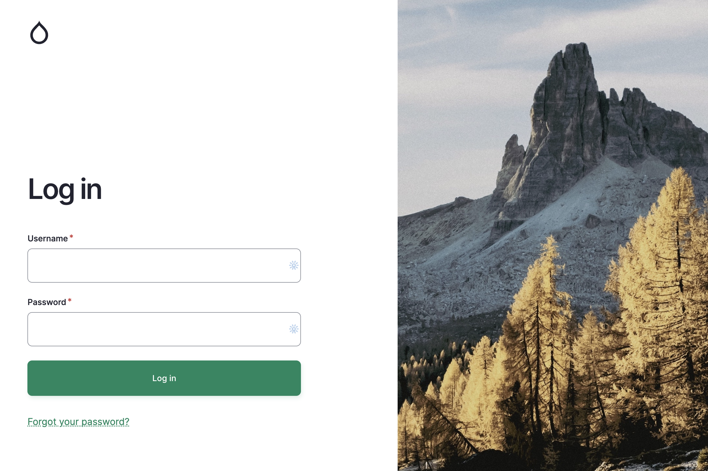
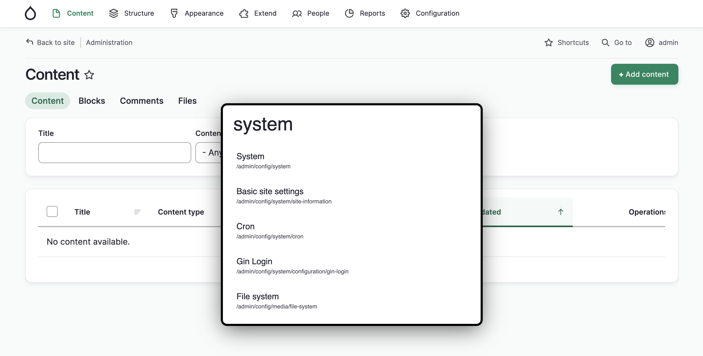
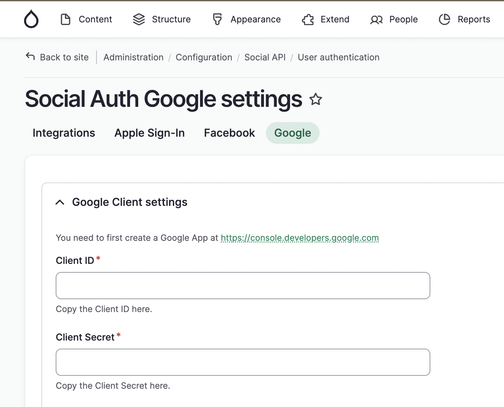

# Drupal Starter

Jump-start your next Drupal project with useful configurations.

## Features

- Always up to date core & contrib
- Drush installed
- Gin theme
- Gin login module
- Require login module
- Admin toolbar module
- Coffee module

## Installation

1. Install DDEV if not already installed - https://ddev.com.
2. Clone this repository with `git clone git@github.com:acondura/drupal-starter.git`.
3. (Optional) If you renamed your project, for example `git clone git@github.com:acondura/drupal-starter.git myproject`, please run `ddev config` and supply the name of your project (e.g. `myproject`) at step 1. Leave the rest of the steps untouched. Otherwise, skip this step, proceed to step 4.
4. Go to your cloned project and run `ddev start`.
5. Install from existing configuration with `ddev drush si --existing-config -y`.
6. Access https://drupal-starter.ddev.site (or the one given at step 3, if you named your project differently) with user & password given at the end of the previous command.

## Tips

- Regarding drush commands, for less typing, you can add an alias to your Windows/Linux user profile as `alias ddr="ddev drush"`.
- If working locally, for easy login, you can run `ddr upwd admin admin`. Just be sure to change your admin password if making this instance public.
